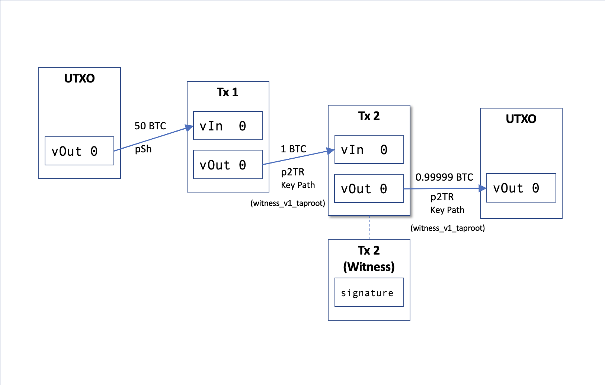
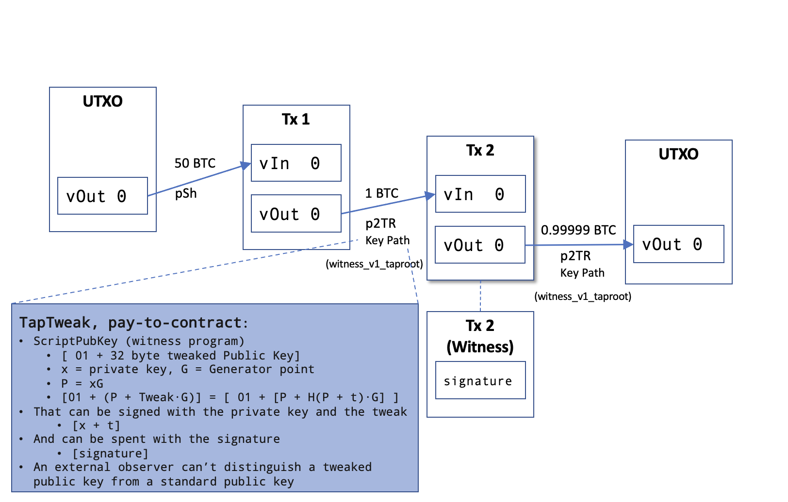

## P2TR_Key_Path Case Study

In this scenario we will create a Tx locked with a Taproot Key Path and we will expend it using the signature, we will also learn hot to tweak keys. We will do the following, as depicted in Figure 1:

1. Generate a new Coinbase UTXO.
2. Create a Tx1 with an P2TR output, using the selected UTXO as input.  On step 3 we will spend it.
3. Manually create Tx2 that spends from the P2TR output from Tx1, using the witness stack to provide the signature, and create a new P2TR Key Path output.
4. Explain the properties of schnorr signatures that allow for Tweaking the Public Key to commit a message using pay-to-contract commitment.

It's important to mention that even though we are referring as P2TR Key Path outputs, all P2TR outputs are indistinguishable from each other, we only make the mention to be clear what type of output we are creating for clarity of the exercise.

_Note: to maintain the scenario simple, we are not generating change outputs._

Figure 1


1. Generate a new coinbase UTXO

Call generate on our node and generate 101 blocks (`COINBASE_MATURITY + 1`) to be able to have a spending UTXO. Select the last UTXO.

```python
blocks = self.generate(self.nodes[0], COINBASE_MATURITY + 1)
utxos = self.nodes[0].listunspent()
unspent_txid = self.nodes[0].listunspent()[-1]["txid"]
```

2. Create Tx1

Create the first transaction using the selected UTXO as input.

Create a Bip340 32 bytes Public Key and a bech32m address to generate a P2TR Key Path[^2], witness_v1_output. In Tx2 we will create a P2TR Key Path output manually, and spend from this Tx1 output.

```python
# Key pair generation
privkey = ECKey()
privkey.generate()
# Compute x only pubKey, Bip340 32 bytes Public Key
pubkey, negated= compute_xonly_pubkey(privkey.get_bytes())

# Create witness program ([32B x-coordinate])
program = pubkey

# Create (regtest) bech32m address
version = 0x01 # Segwit v1
address = program_to_witness(version, program)
self.log.info("bech32m address is {}".format(address))

# Create and sign transaction
tx1_amount = 1
tx1_hex = self.nodes[0].createrawtransaction(inputs=input, outputs=[{address: tx1_amount}])
res = self.nodes[0].signrawtransactionwithwallet(hexstring=tx1_hex)

# Send the raw transaction. We haven't created a change output,
# so maxfeerate must be set to 0 to allow any fee rate.
tx1_id = self.nodes[0].sendrawtransaction(hexstring=tx1_hex, maxfeerate=0)
```


3. Create Tx2

Create a P2TR Key Path scriptPubkey, 1 and the 32 byte of the Public Key, as per [Bip: 341, Witness program](https://github.com/bitcoin/bips/blob/master/bip-0341.mediawiki#script-validation-rules), SegWit v1.[^3]

```python
# Generate a P2TR scriptPubKey 01(segwit v1) <pubkey>
script_pubkey = CScript([OP_1, pubkey])
```

Then manually assemble the Tx2, using Tx1 P2TR output as input.

```python
# Manually assemble the Tx2, using Tx1 P2TR output as input.
tx2 = CTransaction()
tx2.nVersion = 1
tx2.nLockTime = 0
outpoint = COutPoint(int(tx1_id,16), 0)

# No scriptSig, the signature will be on the witness stack
tx2.vin.append(CTxIn(outpoint, b""))

# scriptPubKey is witness v1: 0 and 32 byte Public Key
dest_output = CTxOut(nValue=((tx1.vout[0].nValue)- 1000), scriptPubKey=script_pubkey)
tx2.vout.append(dest_output)
```

Generate the sighash.

As specified in [BIP: 341: Taproot: SegWit version 1 spending rulesi, Signature validation rules](https://github.com/bitcoin/bips/blob/master/bip-0341.mediawiki#signature-validation-rules),
we provide: the script `OP_DUP, OP_HASH160, hash, OP_EQUALVERIFY, OP_CHECKSIG` (`0x19 76 a9 14{20-byte-pubkey-hash}88 ac`) (see item5 detail for P2WPKH in [Bip: 143](https://github.com/bitcoin/bips/blob/master/bip-0143.mediawiki#specification)), this tx=Tx2, input index, hashtype, and the value of the output spent by this input (prev Tx vout amount), to the sighash function for SegWit. In this case as in almost every standard Tx, `hashtype` is `SIGHASH_ALL`.[^3]

SIGHASH_DEFAULT is a new sighash flag, and it's value is 0x00, its prurpose is to avoid having to append the sighash flag to the signature, all the other sighash flags require them to be appended to the end of the signature.

```python
# Generate the taproot signature hash for signing

sighash = TaprootSignatureHash(  tx2, 
                                 [tx1.vout[0]], 
                                 SIGHASH_DEFAULT, 
                                 input_index= 0, 
                                 scriptpath= False
                              )
```

Sign the Tx with Schnorr, as is a SegWit v1.

```python
# All schnorr sighashes except SIGHASH_DEFAULT require
# the hash_type appended to the end of signature
signature = sign_schnorr(privkey.get_bytes(), sighash)
```

Add signature to the witness stack, this the unlocking condition required to be able to spend from the P2TR output of Tx1.

```python
# All schnorr sighashes except SIGHASH_DEFAULT require
# the hash_type appended to the end of signature
signature = sign_schnorr(privkey.get_bytes(), sighash)
``` 

Check mempool acceptance of our transaction and send it to mempool.

```python
assert self.nodes[0].testmempoolaccept(rawtxs=[tx2_hex], maxfeerate=0)[0]['allowed']
tx2_id = self.nodes[0].sendrawtransaction(hexstring=tx2_hex)
```

4. Tweak Public Key using pay-to-contract

The linearity of Schnorr signatures allow for public and Private Key tweaking. Tweaking means encoding a commitment into a key pair. The secure way to tweak a key pair, to commit to a message, is using pay-to-contract: H(P | c), this means hasing the concatenation of the Public Key with the commitment.[^1] 

It's generally recommendable to tweak the Public Key to avoid the use of the same Public Key for privacy reasons.

Figure 2



First we generate a Private Key/Public Key pair.
```python
# Key pair generation
privkey = ECKey()
privkey.generate()
# Compute x only pubKey, Bip340 32 bytes Public Key
pubkey, negated = compute_xonly_pubkey(privkey.get_bytes())
```

Lets generate a commitment.
To be able to do the add tweak, we need to convert it to a pay-to-contract H(P | c) so we use the TaggedHash() function from the functional framework.

```python
contract = "This is the contract/message commitment"
tagged_hash = TaggedHash("TapTweak", pubkey.get_bytes() + contract.encode('utf-8'))
```

Now we can do the tweaking of the key pair.

```python
# Tweak key pair
tweak_PrivKey = tweak_add_privkey(privkey.get_bytes(), tagged_hash)
tweak_PubKey  = tweak_add_pubkey(pubkey, tagged_hash)
```

Now we can proceed to sign a message and verify the signature.
```python
# Sign message and verify a signature
msg = hashlib.sha256(b'message').digest()
signature = sign_schnorr(tweak_PrivKey, msg)
verify_signature = verify_schnorr(tweak_PubKey[0], signature, msg)
self.log.info(verify_signature)
```

Finally, this Tweaked Public Key can be used as an P2TR Key Path output and the Tweaked Private Key to sign the spending transaction, as we did with the internal Public Key and the Private Key in the firt part of this case study.


Full [Python script](create_P2TR_Key_Path.py)


[^1]: [Optech, Taproot-Workshop](https://github.com/bitcoinops/taproot-workshop)
[^2]: [BIP 340, Taproot, Schnorr Signatures for secp256k1](https://github.com/bitcoin/bips/blob/master/bip-0340.mediawiki)
[^3]: [BIP 341, Taproot, SegWit version 1 spending rules](https://github.com/bitcoin/bips/blob/master/bip-0341.mediawiki)
[^4]: [BIP 342, Taproot, Validation of Taproot Scripts](https://github.com/bitcoin/bips/blob/master/bip-0342.mediawiki)

