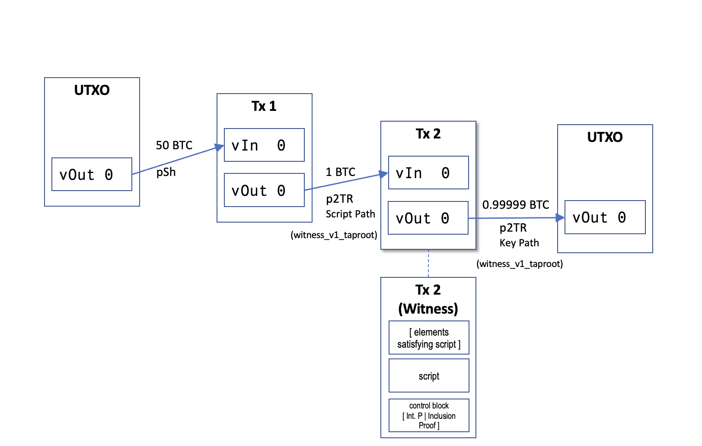
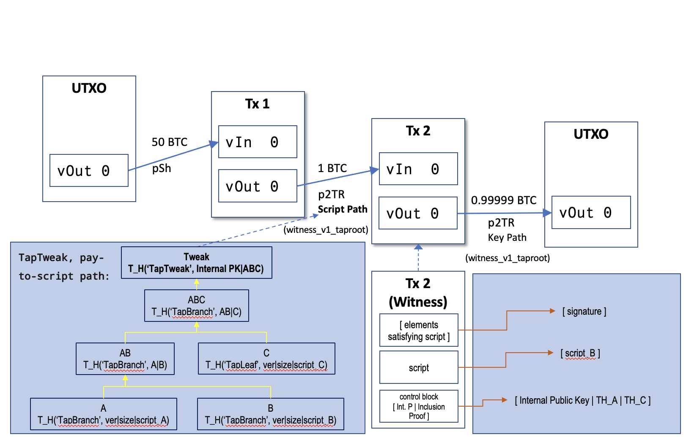
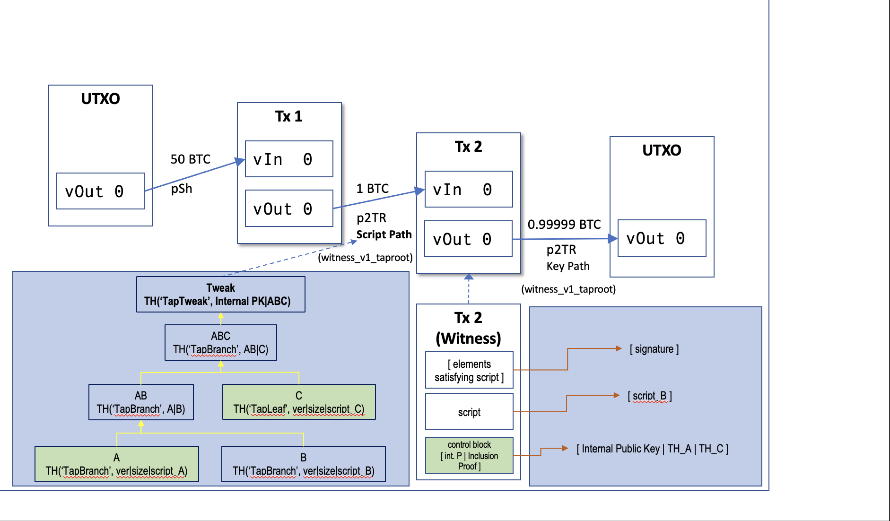

## P2TR_Script_Path Case Study

It's recommended to take a look first at the [P2TR_Key_Path Case Study](P2TR_Key_path_Case_Study.md)

In this scenario we will create a Tx locked with a tree of Taproot scripts and we will expend it using the script on branch B, we will do the following, as depicted in Figure 1:


1. Create a couple of helper functions
2. Generate a new Coinbase UTXO.
3. Generate the key pairs we will use to create the script tree
4. Create the 3 distinct scripts PK we will use
5. Manually create the script tree, leaves and branches
6. Compute the TapTweak of the root of the tree
7. Derive our bech23m address
8. Create a Tx1 with a P2TR output, using the selected UTXO as input.  On step 9 we will spend it.
9. Manually create Tx2 that spends from the P2TR output from Tx1 using the witness stack to provide: the elements that satisfy the script, the script and the controlblock 

It's important to mention that even dough we are referring as P2TR Script Path outputs, all P2TR outputs are indistinguishable from each other, we only make the mention to be clear what type of output we are creating for clarity of the exercise.

_Note: to maintain the scenario simple, we are not generating change outputs._

Figure 1


1. Create a couple of helper functions

Some of this functions are part of the version of the Functional Test Framework used in the Optech Taproot Workshop, since I'm using Bitcoin Core v24 Functional Test Framework and some of them are not in the v24, I had to create them. Most have to do with 32 byte Public Keys used in Taproot and with negation, also related. I might create a PR to add some of them, the ones that make sense, to Bitcoin Core.

These are the functions:

```python
""" Get Y coordenate from Public Key """
def get_y(key):
    return SECP256K1.affine(key.p)[1]

def negate_privKey(key):
    """Negate a Private Key."""
    assert key.valid
    key.secret = SECP256K1_ORDER - key.secret

def negate_pubKey(key):
    """ Negate a Public Key """
    key.p = SECP256K1.affine(SECP256K1.negate(key.p))

def get_bytes(key):
    """ Get bip340, 32 bytes of Public Key """
    assert key.valid
    p = SECP256K1.affine(key.p)
    if p is None:
        return None
    return bytes(p[0].to_bytes(32, 'big'))

def generate_bip340_key_pair():
    """Key pair generation""" 
    privkey = ECKey()
    privkey.generate()
    pubkey = privkey.get_pubkey()

    # Compute x only pubKey, Bip340 32 bytes Public Key
    #pubkey, negated = compute_xonly_pubkey(privkey.get_bytes())
    if get_y(pubkey) % 2 != 0:
       negate_privKey(privkey) 
       negate_pubKey(pubkey)
    assert_equal(len(get_bytes(pubkey)), 32)

    return privkey.get_bytes(), get_bytes(pubkey)

def tapbranch_hash(left, right):
    """Create TapBranch sorting lexicographically"""
    return TaggedHash("TapBranch", b''.join(sorted([left, right])))
```

2. Generate a new coinbase UTXO

Call generate on our node and generate 101 blocks (`COINBASE_MATURITY + 1`) to be able to have an spending UTXO. Select the last UTXO.

```python
blocks = self.generate(self.nodes[0], COINBASE_MATURITY + 1)
utxos = self.nodes[0].listunspent()
unspent_txid = self.nodes[0].listunspent()[-1]["txid"]
```

3. Generate the key pairs we will use to create the script tree

We generate the internal Public Key and Private Keys, as well as public and Private Keys for all of our future scripts A,B and C.

```python
# Generate key pairs
internal_privkey, internal_pubkey = generate_bip340_key_pair()

privkey_A, pubkey_A = generate_bip340_key_pair()
privkey_B, pubkey_B = generate_bip340_key_pair()
privkey_C, pubkey_C = generate_bip340_key_pair()
```

4. Create the 3 distinct scripts PK scripts we will use

All the scripts we will be using are PK scripts, therefore the script should be `[<pubkey> OP_CHECKSIG]`

```python
# create PK scripts
script_A = CScript([pubkey_A, OP_CHECKSIG])
script_B = CScript([pubkey_B, OP_CHECKSIG])
script_C = CScript([pubkey_C, OP_CHECKSIG])
```


5. Manually create the script tree leaf and branches

We will create a script tree as depicted in Figure2, using the TaggedHash() function and our helper function tapbranch_hash(), to compute the internal and root branches of the tree.

Figure 2


```python
# Hash TapLeaves with version, length and script (ser_string() appends compact size length)
hash_A = TAPSCRIPT_VERSION + ser_string(script_A)
hash_B = TAPSCRIPT_VERSION + ser_string(script_B)
hash_C = TAPSCRIPT_VERSION + ser_string(script_C)
TH_Leaf_A = TaggedHash("TapLeaf", hash_A)
TH_Leaf_B = TaggedHash("TapLeaf", hash_B)
TH_Leaf_C = TaggedHash("TapLeaf", hash_C)

# Compute branches
branch_AB = tapbranch_hash(TH_Leaf_A, TH_Leaf_B)
branch_ABC = tapbranch_hash(branch_AB, TH_Leaf_C)
```

6. Compute the TapTweak of the root of the tree

Then we compute the TapTweak, tagging our branch_ABC with the "TapTweak" tag and the Internal Publuc Key.

```python
# Compute TapTweak
tap_tweak = TaggedHash("TapTweak", internal_pubkey + branch_ABC)
self.log.info("TapTweak: {}".format(tap_tweak.hex()))
```

7. derive our bech32M P2TR address

Now that we have the TapTweak of the tree, we can use it to add it to our Internal Pub Key, and use this Key aggregated to generate a bech32m P2TR address. It's important to note that the aggregated key is indistinguishable from any Public Key.

```python
# Derive bech32m address
# TODO tweak_add_pubkey() functon sometimes return negated True and the mempool accept of tx1 fails
# I will either find a way to negate it and see if that works, will be worth to understand why this
# happens, considering that all privkeys and pubkeys used have been negated if needed
taproot_PK_bytes, negated = tweak_add_pubkey(internal_pubkey, tap_tweak)
self.log.info("Negated: {}".format(negated))
bech32m_address = program_to_witness(1, taproot_PK_bytes)
```

8. Create a Tx1 with a P2TR output, using the selected UTXO as input.  On step 9 we will spend it.

Create the first transaction using the selected UTXO as input.

Use bech32m address generated on step 7 to generate a P2TR Script Path[^2], witness_v1_output, in Tx2 we will create a P2TR Key Path output manually, and spend from this Tx1 output.

```python
# Create Tx1 using the address obtained with our tweaked Public Key
tx1_amount = 1
tx1_hex = self.nodes[0].createrawtransaction(inputs=input, outputs=[{bech32m_address: tx1_amount}])
res = self.nodes[0].signrawtransactionwithwallet(hexstring=tx1_hex)

# Send the raw transaction. We haven't created a change output,
# so maxfeerate must be set to 0 to allow any fee rate.
tx1_id = self.nodes[0].sendrawtransaction(hexstring=tx1_hex, maxfeerate=0)
```
8. Create Tx2

Create a P2TR Key Path scriptPubkey, with the script `[0 and the 32 byte of the Public Key]`, as per [Bip: 341,Script validation rules](https://github.com/bitcoin/bips/blob/master/bip-0341.mediawiki#script-validation-rules), SegWit v1.[^3]

```python
# Generate a P2TR scriptPubKey `[01(segwit v1)  <pubkey>(32 bytes in hex)]`
script_pubkey = CScript([OP_1, internal_pubkey])
```

Then manually assemble the Tx2, using Tx1 P2TR output as input.

```python
# Manually assemble the Tx2, using Tx1 P2TR output as input.
tx2 = CTransaction()
tx2.nVersion = 2
tx2.nLockTime = 0
outpoint = COutPoint(int(tx1_id,16), 0)
# No scriptSig, the spending conditions will be on the witness stack
tx2.vin.append(CTxIn(outpoint, b""))
# scriptPubKey is witness v1: [1 and 32 byte Public Key]
dest_output = CTxOut(nValue=((tx1.vout[0].nValue)- 1000), scriptPubKey=script_pubkey)
tx2.vout.append(dest_output)
```

Generate the sighash for signing.

We provide: the script (see [Bip: 341, Script validation rules](https://github.com/bitcoin/bips/blob/master/bip-0341.mediawiki#user-content-Specification)), this tx=Tx2, input index, hashtype SIGHASH_DEFAULT, the scriptpath set to True, the script of the path we will be spending (in this case script_B), to the sighash function for Taproot. 

```python
# Generate the taproot signature hash for signing
# SIGHASH_ALL_TAPROOT is 0x00
sighash = TaprootSignatureHash(  tx2, 
                                 [tx1.vout[0]], 
                                 SIGHASH_DEFAULT, 
                                 input_index = 0, 
                                 scriptpath = True,
                                 script = script_B 
                              )
```

Sign the Tx with Schnorr, as is a SegWit v1 (Taproot).

```python
# All schnorr sighashes except SIGHASH_DEFAULT require
# the hash_type appended to the end of signature
signature = sign_schnorr(privkey.get_bytes(), sighash)
```

Add elements to the witness stack, this are the unlocking conditions to be able to spend from the P2TR output of Tx1.
* Signature
* spending script: script_B
* controlblock, concatenation of:
    * TAPSCRIPT_VERSION
    * internal_pubkey
    * TH_Leaf_A, TH_Leaf_C (inclusion proof), as shown in Figure 3


Figure 3


```python
control_block = b''.join([TAPSCRIPT_VERSION, internal_pubkey, TH_Leaf_A, TH_Leaf_C])
witness_elements = [signature, script_B, control_block] 

# Add witness elements, script and control block 
tx2.wit.vtxinwit.append(CTxInWitness())
tx2.wit.vtxinwit[0].scriptWitness.stack = witness_elements
tx2.rehash()
``` 

Check mempool acceptance of our transaction and send it to mempool.

```python
assert self.nodes[0].testmempoolaccept(rawtxs=[tx2_hex], maxfeerate=0)[0]['allowed']
tx2_id = self.nodes[0].sendrawtransaction(hexstring=tx2_hex)
```

9. Tweak Public Key using pay-to-contract

The linearity of Schnorr signatures allow for public and Private Key tweaking. Tweaking means encoding a commitment into a key pair. The secure way to tweak a key pair, is using pay-to-contract: H(P | c), this means hasing the concatenation of the Public Key with the commitment.[^1] 

First we generate a Private Key/Public Key pair.
```python
# Key pair generation
privkey = ECKey()
privkey.generate()

# Compute x only pubKey, Bip340 32 bytes Public Key
pubkey= compute_xonly_pubkey(privkey.get_bytes())
```

Lets generate a commitment.
To be able to do the add tweak, we need to convert it to a pay-to-contract H(P | c) so we use the TaggedHash() function from the functional framework.

```python
contract = "This is the contract/message commitment"
tagged_hash = TaggedHash("TapTweak", pubkey.get_bytes() + contract.encode('utf-8'))
```

Now we can do the tweaking of the key pair.

```python
# Tweak key pair
tweak_PrivKey = tweak_add_privkey(privkey.get_bytes(), tagged_hash)
tweak_PubKey  = tweak_add_pubkey(pubkey, tagged_hash)
```

We can proceed to sign a message and verify the signature, this tweaked Public Key can be used as an P2TR Key Path output and the tweaked private key to sign the transaction as we did in Tx1.

```python
# Sign message and verify a signature
msg = hashlib.sha256(b'message').digest()
signature = sign_schnorr(tweak_PrivKey, msg)
verify_signature = verify_schnorr(tweak_PubKey[0], signature, msg)
self.log.info(verify_signature)
```


Full [Python script](create_P2TR_Key_Path.py)


[^1]: [Optech, Taproot-Workshop](https://github.com/bitcoinops/taproot-workshop)
[^2]: [BIPS 340, Taproot, Schnorr Signatures for secp256k1](https://github.com/bitcoin/bips/blob/master/bip-0340.mediawiki)
[^3]: [BIPS 341, Taproot, SegWit version 1 spending rules](https://github.com/bitcoin/bips/blob/master/bip-0341.mediawiki)
[^4]: [BIPS 342, Taproot, Validation of Taproot Scripts](https://github.com/bitcoin/bips/blob/master/bip-0342.mediawiki)
