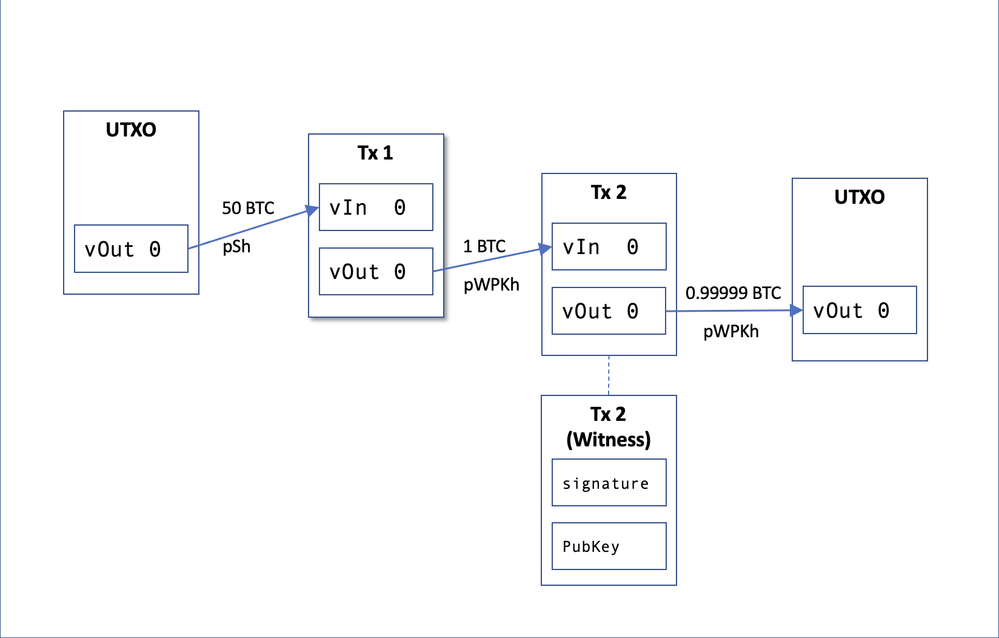

## P2PWKH Case Study

In this scenario we will do the following, as depicted in Figure 1.


1. Generate a new coinbase UTXO
2. Use this last UTXO to send 1 BTC by creating Tx1 with a P2WPKH output, we do this generating a Bech32 address
3. Create Tx2 manually, to spend P2PWKH output from Tx1 and generate a new P2PWKH output

_Note: to maintain the scenario simple, we are not generating change outputs._

Figure 1


1. Generate a new coinbase UTXO

Call generate on our node and generate 101 blocks (`COINBASE_MATURITY + 1`) to be able to have an spending UTXO. Select the last UTXO.

```python
blocks = self.generate(self.nodes[0], COINBASE_MATURITY + 1)
utxos = self.nodes[0].listunspent()
unspent_txid = self.nodes[0].listunspent()[-1]["txid"]
```

2. Create Tx1

Create the first transaction using the selected UTXO as input.

Create a bech32 address to generate a P2PWKH output, in Tx2 we will create manually a P2PWKH and spend from this Tx1 output.

```python
# Create (regtest) bech32 address and UTXO
version = 0x00
address = program_to_witness(version, pubkey_hash )
input = [{"txid": unspent_txid, "vout": 0}]
tx1_hex = self.nodes[0].createrawtransaction(inputs=input, outputs=[{address: tx1_amount}])
res = self.nodes[0].signrawtransactionwithwallet(hexstring=tx1_hex)
```


3. Create Tx2

Create a P2WPKH scriptPubkey, 0 and the 20 byte hash of the Public Key, as per [Bip: 141, Witness program](https://github.com/bitcoin/bips/blob/master/bip-0141.mediawiki#witness-program), SegWit v0.

```python
# SegWit v0 scriptPubKey
script_pubkey = CScript([0, pubkey_hash]) 
```

Then manually assemble the Tx2, using Tx1 P2PWKH output as input.

```python
tx2 = CTransaction()
tx2.nVersion = 1
tx2.nLockTime = 0
outpoint = COutPoint(int(tx1_id,16), 0)
# No scriptSig, the signature and pubKey will be on the witness stack
tx2.vin.append(CTxIn(outpoint, b""))
# scriptPubKey is witness v0: 0 and 20 byte hash of the public key
dest_output = CTxOut(nValue=((tx1_amount * COIN)- 1000), scriptPubKey=script_pubkey)
tx2.vout.append(dest_output)
```

Generate the sighash.

As specified in [BIP: 143: Transaction Signature Verification for Version 0 Witness Program](https://github.com/bitcoin/bips/blob/master/bip-0143.mediawiki#specification),
we provide: the script `OP_DUP, OP_HASH160, hash, OP_EQUALVERIFY, OP_CHECKSIG` (`0x19 76 a9 14{20-byte-pubkey-hash}88 ac`) (see item5 detail for P2WPKH in [Bip: 143](https://github.com/bitcoin/bips/blob/master/bip-0143.mediawiki#specification)), this tx=Tx2, input index, hashtype, and the value of the output spent by this input (prev tx vout amount), to the sighash function for SegWit. In this case as in almost every standard tx, `hashtype` is `SIGHASH_ALL`.
```python
# Generate the segwit v0 signature hash for signing
# Script: OP_DUP, OP_HASH160, hash, OP_EQUALVERIFY, OP_CHECKSIG
script = keyhash_to_p2pkh_script(pubkey_hash)
sig_hash = SegwitV0SignatureHash(script=script,
                                 txTo=tx2, 
                                 inIdx=0, 
                                 hashtype=SIGHASH_ALL, 
                                 amount=tx1_amount * COIN)
```

Sign the Tx with ECDSA, as is a SegWit v0.

```python
# Sign using ECDSA appending SIGHASH_ALL
signature = key.sign_ecdsa(sig_hash) + chr(SIGHASH_ALL).encode('latin-1')  
```

Add signature and public key to the witness stack, this are the unlocking conditions to be able to spend from the P2WPKH output of Tx1.
```python
# Add a witness to the transaction. For a P2WPKH, the witness field is the list of signature and pubkey
tx2.wit.vtxinwit.append(CTxInWitness())
tx2.wit.vtxinwit[0].scriptWitness.stack = [signature, pubkey]
tx2.rehash()
``` 


Full [Python script](create_P2PKH.py)
